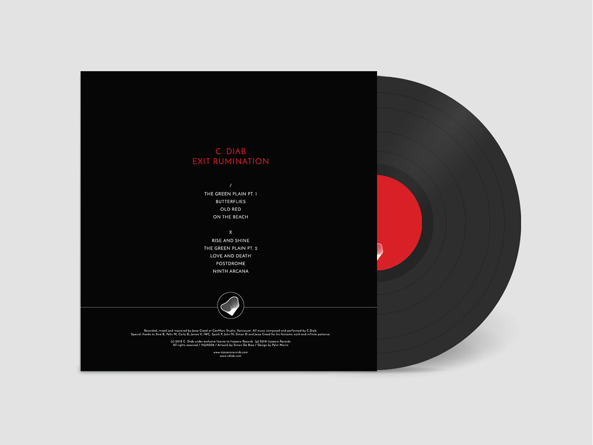

## Vinyl Record Collection Inventory

The project consists of creating a small application which makes use of web services as the main communication interface between the back-end of the application and the front-end of the application.

The application will be straightforward. It will have several screens which can be used to record a vinyl record collection inventory.

Basically, collectors of vinyl records can be meticulous about keeping track of the inventory of the albums they have and the condition. We will write an application which will do this.

Things to keep track of:

1. Name of Album
2. UPC Code (Optional)
3. Pressing year
4. Artist or Group
5. [Condition of the album](https://support.discogs.com/hc/en-us/articles/360001566193-How-To-Grade-Items)
6. Free-form notes
